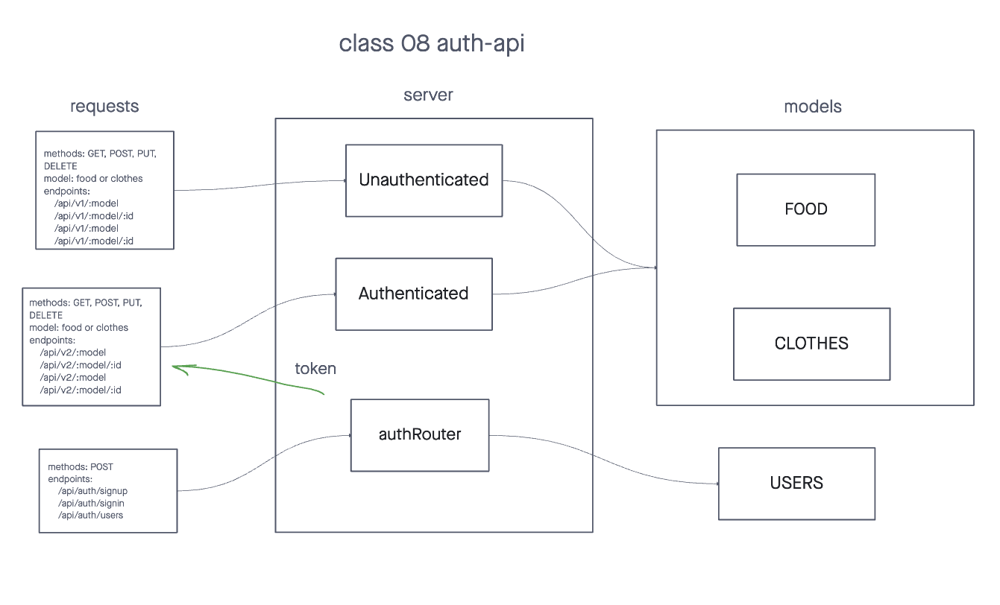

# Bearer Auth

>  **Authentication Server Phase 3: Role Based Access Control** Being able to login is great. But controlling access at a more granular level is vital to creating a scalable system. In this lab, you will implement Role Based Access Control (RBAC) using an Access Control List (ACL), allowing to not only restrict access to routes for valid users, but also based on the individual permissions we give each user.

## Installation

> Start with: `npm install`

> Set your PORT environment with an .env file

```text
PORT=3001
DATABASE_URL={SQL_database_link}
SECRET={Secret_code_for_bcrypt}
```

## Usage

Auth route requests:
```text
method: POST
route: /api/auth/signup
route: /api/auth/signin
```

Unauthenticated route request:
```text
method: GET, POST, PUT, DELETE
modelL: food or clothes
route: /api/v1/:model/:id
```

Authenticated route request:
```text
method: GET, POST, PUT, DELETE
modelL: food or clothes
route: /api/v1/:model/:id
```

## UML Diagram


## PR link
[PR link Class 07](https://github.com/cleecoloma/auth-api/pull/1)

## Contributors
> Chester Lee Coloma